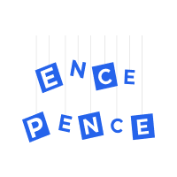

<p align="center">
  
</p>

<p align="center"><strong>A performant and modern Static Site Generated web application designed for nurseries</strong></p>

<p align="center">
  
  
  
  <br />
  <a href="./contributing.md">
    
  </a>
 <a href="https://app.netlify.com/sites/ence-pence-huta-next/deploys">
    
  </a>
</p>

# Ence Pence 👶

Ence Pence Huta is a modern, performant web application designed as a promotional website for a nursery. The website offers parents a comprehensive view of the nursery's facilities, programs, and values, helping them make informed decisions when choosing the right environment for their children.

- 🌐 [**Live Site**](https://ence-pence-huta-next.netlify.app/)
- 📚 [**Storybook**](https://m-kolacz.github.io/ence-pence-huta-next/)
- 🎨 [**Figma Design**](https://www.figma.com/design/zx5FkmiDiV7F8Jn5phnpeJ/Ence-Pence-Huta?node-id=3-3&t=wd9jzcLxvfWzEG6E-1)

## Tech Stack 💻

The project is built using the following modern technologies and tools:

- **[Next.js 15](https://nextjs.org/)**
- **[TypeScript](https://www.typescriptlang.org/)**
- **[Tailwind CSS](https://tailwindcss.com/)**
- **[Playwright](https://playwright.dev/)**
- **[Storybook](https://storybook.js.org/)**

## Getting Started 🚀

Follow these steps to set up and run the project locally on your machine.

### Prerequisites 📋

Before starting, make sure you have the following tools installed:

- [Git](https://git-scm.com/)
- [Node.js](https://nodejs.org/en/) - v20.18.0 or higher
- [NVM](https://github.com/nvm-sh/nvm) - recommended
- [NPM](https://www.npmjs.com/) - v10.8.2 or higher

### Installation steps 🔧

Fire up your terminal and run the following commands:

```sh
# Clone the repository
$ git clone https://github.com/M-Kolacz/ence-pence-huta-next.git
# Navigate into the project directory:
$ cd ence-pence-huta-next
# Switch to the correct Node version: (If using NVM)
$ nvm use
# Install project dependencies:
$ npm install
# Start the development server:
$ npm run dev
```

Open the app in your browser: http://localhost:3000/.

## Contributing 🤝

I welcome and appreciate all contributions! Whether it’s a small bug fix, new feature, or improvement suggestion, your help is valuable. Please read [Contributing Guidelines](./contributing.md) to get started.

## License 📝

This project is licensed under the **MIT License**, which allows you to use, modify, and distribute the code freely. See the full license details in the [LICENSE](./LICENSE.md) file.
